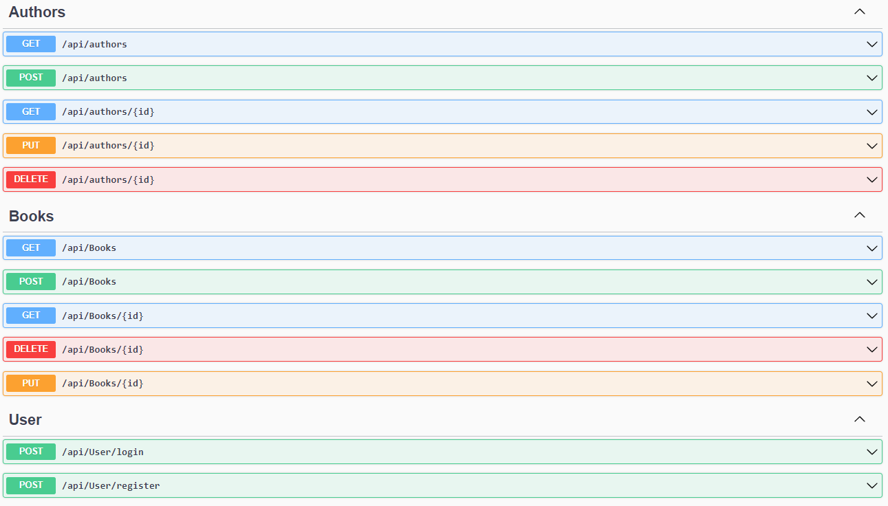

# Simple CRUD Api project with Books and their authors

This repository contains an API, an MVC Client, an MVVM Client and Blazor Client for managing a collection of books with CRUD (Create, Read, Update, Delete) operations. The MVC client is equipped with straightforward JWT authentication, ensuring secure access to book management operations. 

# Technologies Used
<ul>
    <li><strong>ASP.NET Core:</strong> A versatile framework for developing modern, cloud-ready, and connected applications.</li>
    <li><strong>Blazor:</strong> Enables the creation of interactive user interfaces using C# and .NET within web browsers.</li>
    <li><strong>WPF (Windows Presentation Foundation):</strong> A powerful framework for building desktop applications with rich user experiences.</li>
    <li><strong>Bootstrap:</strong> A front-end framework for crafting responsive and visually appealing web interfaces.</li>
    <li><strong>Entity Framework Core:</strong> An object-relational mapping framework facilitating efficient data access and database management.</li>
    <li><strong>PostgreSQL / MSSQL:</strong> Relational database management systems for storing user, book, and system data.</li>
    <li><strong>JWT Authentication:</strong> Ensures secure access to the applications with JSON Web Token authentication.</li>
</ul>

# Azure Deployment

The Api with the database were hosted on Microsoft Azure, but now due to the lack of free credits it is shutdown 

# Api Endpoints

# MVC Client

The rest of the views are just simple CRUD/Auth forms

# MVC Client Dark Mode

# Blazor Client

# MVVM Client

